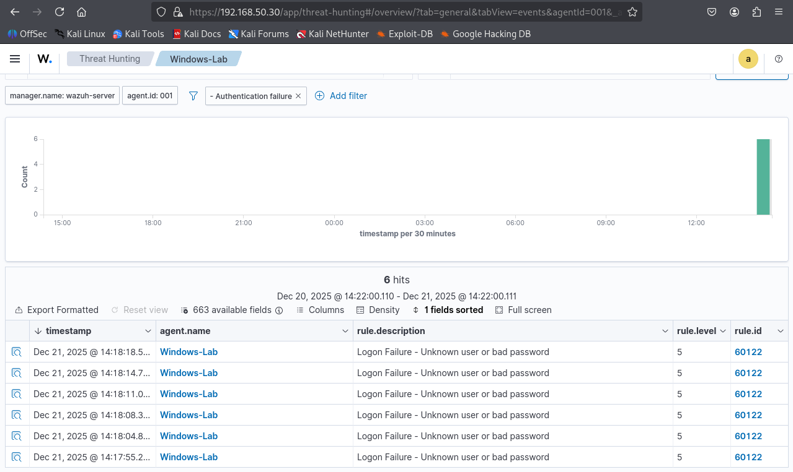
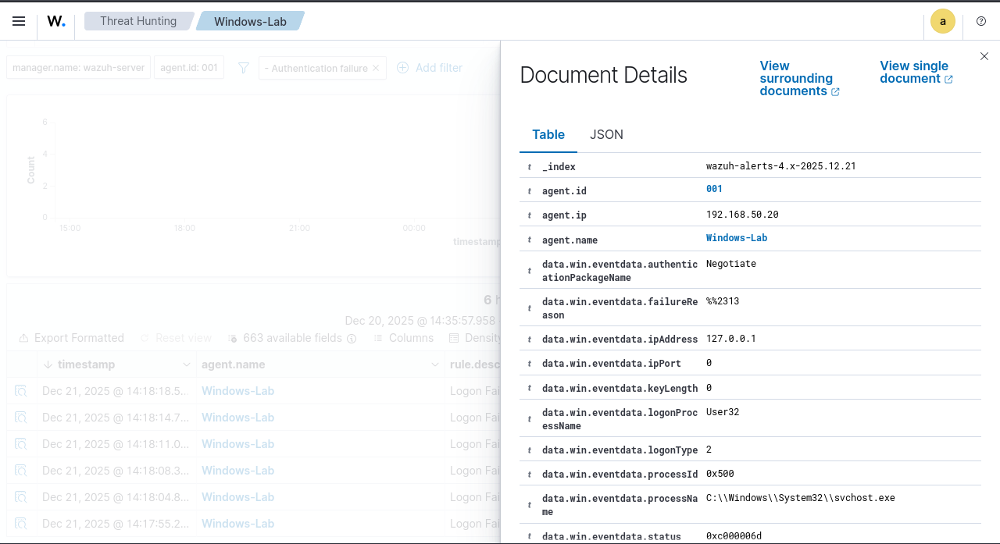
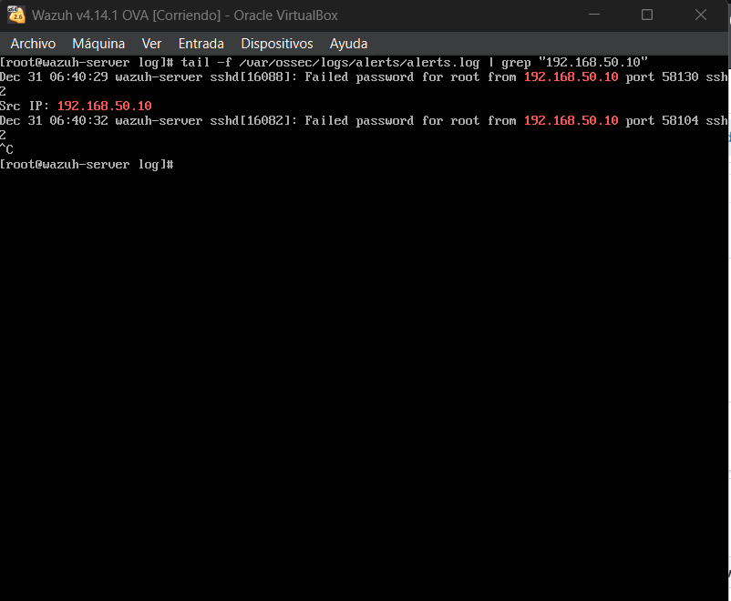
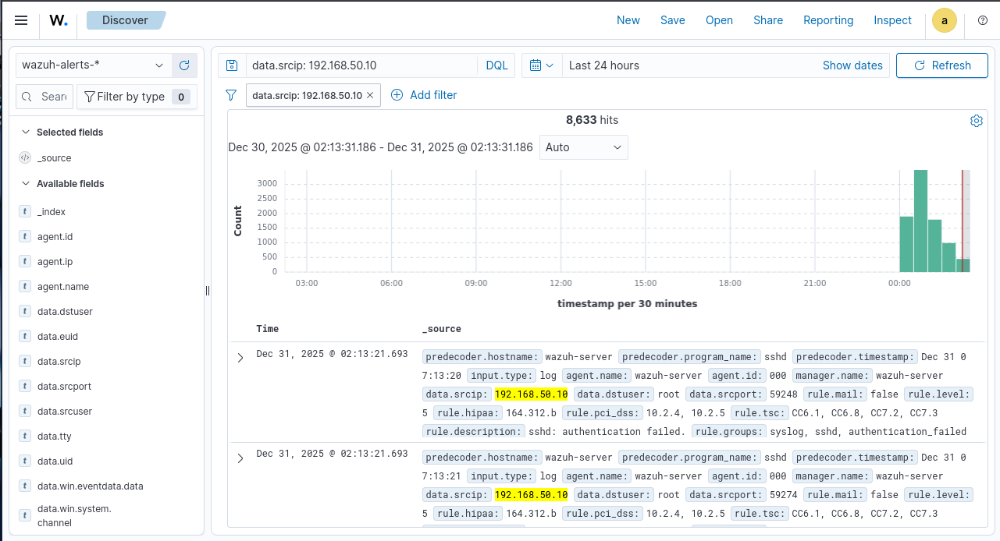
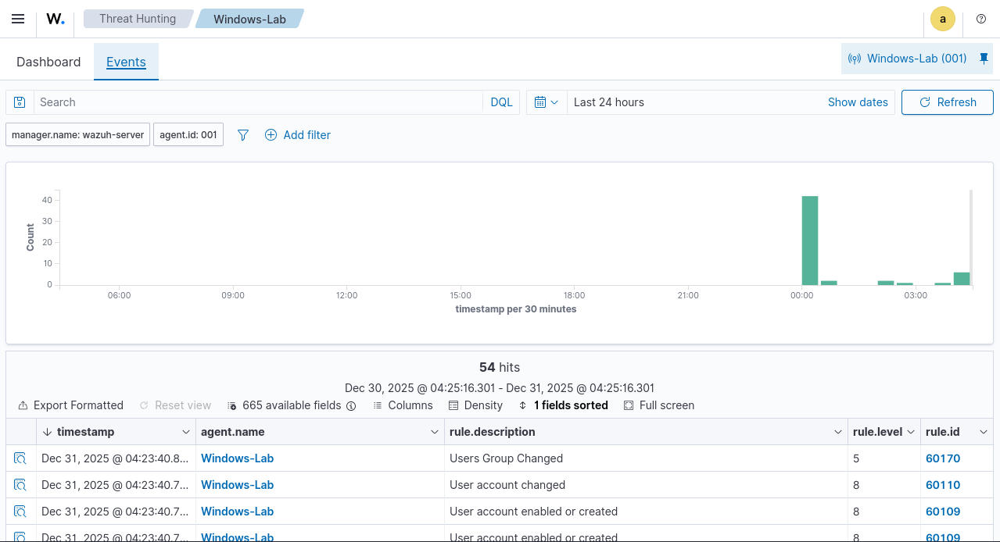
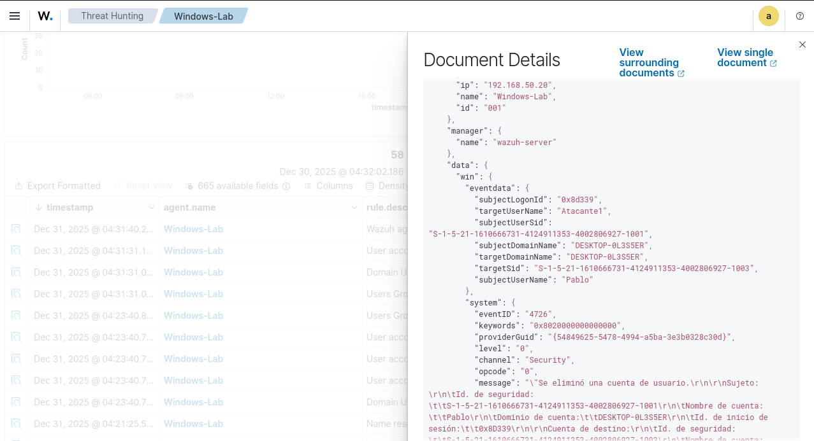

### Proyecto 1: Implementación de un SOC Lab con Wazuh SIEM

**Descripción:** Despliegue de un entorno de monitorización centralizado para detectar y alertar sobre actividades maliciosas en tiempo real.

**Arquitectura del Lab:**
- **SIEM Manager:** Wazuh v4.x (OVA) configurado con IP estática en Red Interna.
- **Endpoint:** Windows 10 con Agente Wazuh instalado para telemetría profunda.
- **Atacante:** Kali Linux configurado en el mismo segmento de red para pruebas de intrusión.

#### Escenario 1: Intentos fallidos de inicio de sesión
- **Acción:** Se realizaron 5 intentos fallidos de inicio de sesión desde la misma máquina
- 

  
Haz clic para ver la imagen

  

- **Resultados:** El SIEM capturó dichos inicios fallidos en el que la regla de descripción detecctó `rule.description: Logon Failure - Unknown user or bad Password`, también se verificó la IP de la máquina donde se estaban haciendo esos intentos fallidos `192.168.50.20`.
- 

  
Haz clic para ver la imagen

  

#### Escenario 2: Detección de Ataque de Fuerza Bruta (SSH)
- **Acción:** Se realizó un ataque de diccionario contra el servicio SSH del Manager usando la herramienta **Hydra** desde Kali.
- **Primera comprobación:** Se va a usar el registro del sistema para ver los eventos de SSH con el siguiente comando `journalctl -f -u sshd` y se verifica que hay una máquina `192.168.50.10` intentando autenticarse
- 

  
Haz clic para ver la imagen

  

- **Resultado:** El SIEM generó una alertas críticas identificando la IP origen del atacante `192.168.50.10` y el usuario objetivo (`root`).
- 

  
Haz clic para ver la imagen

  

#### Escenario 3: Monitorización de Persistencia en Windows
- **Acción:** Creación y borrado de cuentas de usuario mediante **PowerShell** para simular la creación de "puertas traseras".
- **Análisis Forense:** A través del Dashboard de Wazuh, se filtraron los eventos del agente Windows identificando:
- **Creación:** `Rule ID: 60109 - User account enabled or created`.
- 

  
Haz clic para ver la imagen

  

- 

  
Haz clic para ver la imagen

  

- **Borrado:** `Rule ID: 60111 - User account deleted`.
- 

  
Haz clic para ver la imagen

  

- **Valor Técnico:** Se logró identificar el campo exacto `targetUserName: Atacante` dentro del log JSON, demostrando visibilidad total sobre los cambios de privilegios.
#### 🛠️ Desafíos y Troubleshooting (Resolución de problemas)

Durante el despliegue, la máquina OVA no presentaba las credenciales estándar. Utilicé herramientas de línea de comandos de Linux (`find`, `grep`) para localizar los scripts de gestión del Indexer en `/usr/share/wazuh-indexer/` y procedí a resetear manualmente la contraseña del administrador, asegurando la continuidad del laboratorio.
